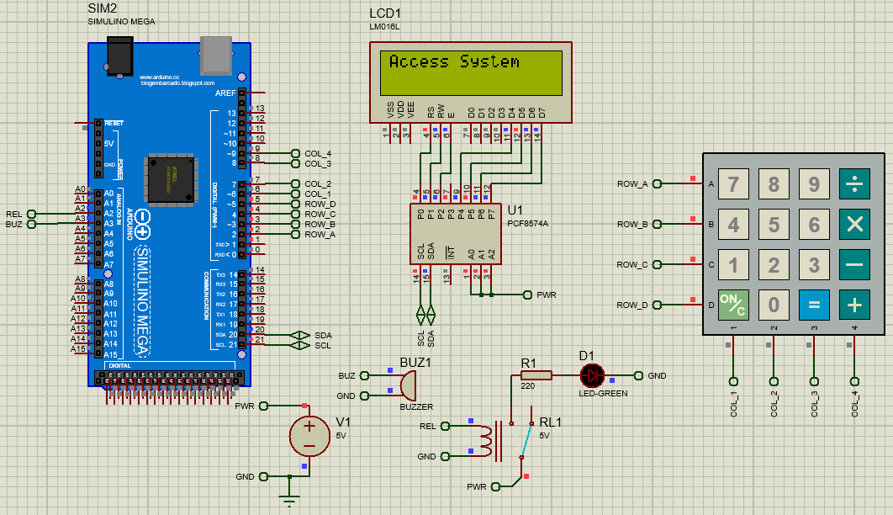
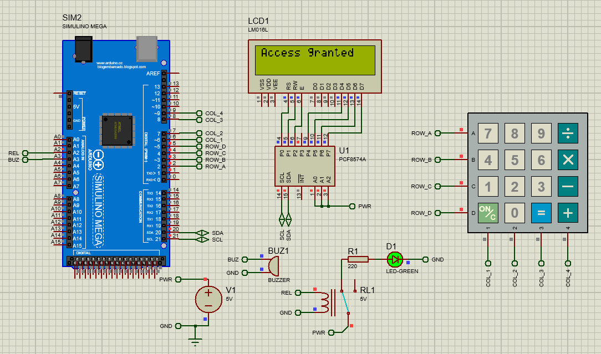
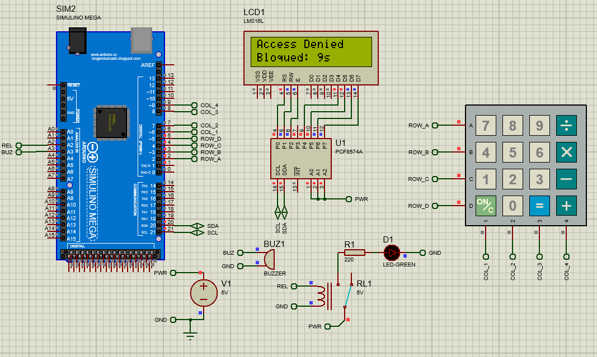

# 🔐 Access Control System with Keypad and LCD

This project implements a **basic access control system** using an **Arduino Mega 2560**.  
The user enters a password through a **4x4 matrix keypad**, and messages are displayed on a **16x2 I²C LCD**.  
When the password is correct, a **relay or LED** simulates a door lock opening. If incorrect, a **buzzer** sounds an alert.  
After three failed attempts, the system locks for a period of time.

---

## 📸 System Screens

| State | Image |
|--------|--------|
| 🟦 **Startup screen** |  |
| 🟩 **Access granted** |  |
| 🟥 **System locked** |  |

---

## ⚙️ Features

- Password entry using a **4x4 matrix keypad** (calculator style).  
- Status messages displayed on a **16x2 LCD with I²C interface (PCF8574A)**.  
- **Relay or LED** represents a door lock mechanism.  
- **Buzzer** for error or lockout alerts.  
- **Timeout auto-clear** if no key is pressed for 5 seconds.  
- **Three failed attempts** trigger a 10-second lockout period.

---

## 🧠 Project Structure

    AccessControlSystem/
    │
    ├── src/
    │ ├── Main.ino # Main program
    │ ├── Config.h # Pin and parameter configuration
    │ ├── KeypadManager.{h,cpp} # Keypad reading and key detection
    │ ├── DisplayManager.{h,cpp} # LCD display control (I²C)
    │ ├── AccessController.{h,cpp} # Password verification and lockout logic
    │
    ├── images/
    │ ├── inicio.png
    │ ├── correcto.png
    │ ├── bloqueado.png
    │ 
    ├── simulation/
    │ ├── Simulacion (Sistema de control de acceso).pdsprj
    │
    └── README.md # Project documentation


---

## 🔌 Hardware Simulation (Proteus)

| Component | Description |
|------------|--------------|
| **Microcontroller** | Arduino Mega 2560 (ATmega2560) |
| **LCD 16x2** | LM016L with PCF8574A (I²C address `0x3F`) |
| **Keypad 4x4** | Calculator-style matrix keypad (Rows A–D, Cols 1–4) |
| **Relay / Lock LED** | Connected to pin **A2** |
| **Buzzer** | Connected to pin **A3** |

### I²C Connections
| LCD Pin | Arduino Pin | Description |
|----------|--------------|-------------|
| VCC | 5V | Power |
| GND | GND | Ground |
| SDA | D20 | I²C data line |
| SCL | D21 | I²C clock line |

---

## ⚙️ System Configuration

Default password is defined in `Main.ino`:

```cpp
AccessController access("5879");
```
---
## 🔑 Other key parameters are in Config.h:

```cpp
#define INPUT_TIMEOUT_MS 5000UL      // Clear input after 5s of inactivity
#define LOCKOUT_DURATION_MS 10000UL  // Lock system after 3 failed attempts
#define MAX_FAILED_ATTEMPTS 3
```

You can modify these constants to customize system behavior.

## 🧪 Simulation in Proteus

- Open the Proteus project (.pdsprj).

- Load the compiled .hex file into the Arduino Uno.

- Use the virtual keypad to enter the password.

- Observe system responses on the LCD and actuator outputs.

## 🧰 Dependencies

- Required Arduino libraries (installable from the Arduino Library Manager or PlatformIO):

- Keypad

- LiquidCrystal_I2C

- Wire (built-in with Arduino IDE)


## 📚 License

This project is licensed under the *MIT License* — you may use, modify, and distribute it freely, provided proper credit is given to the original author.
